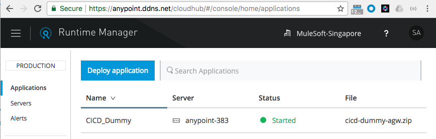
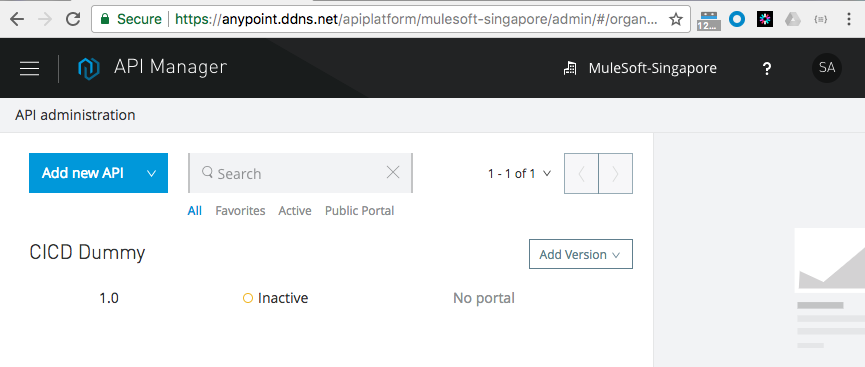
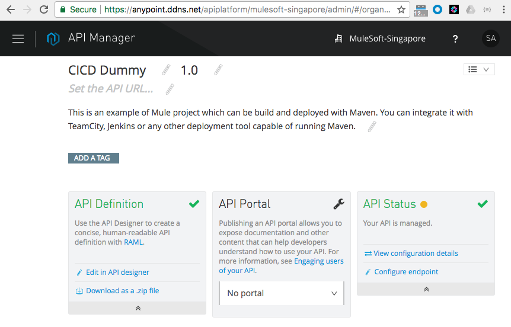
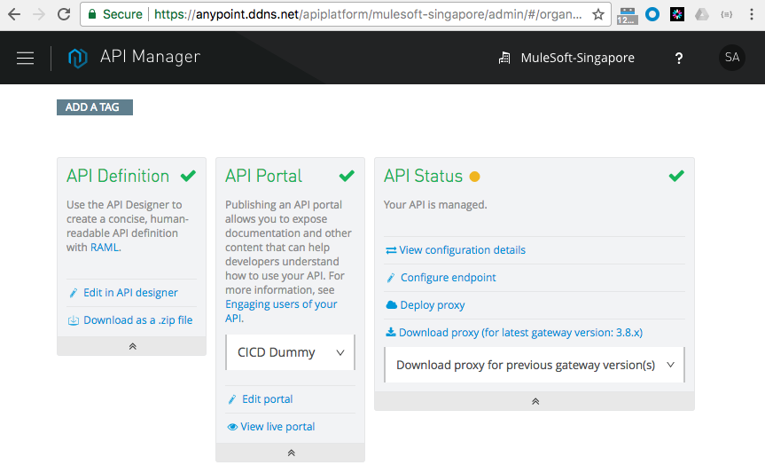
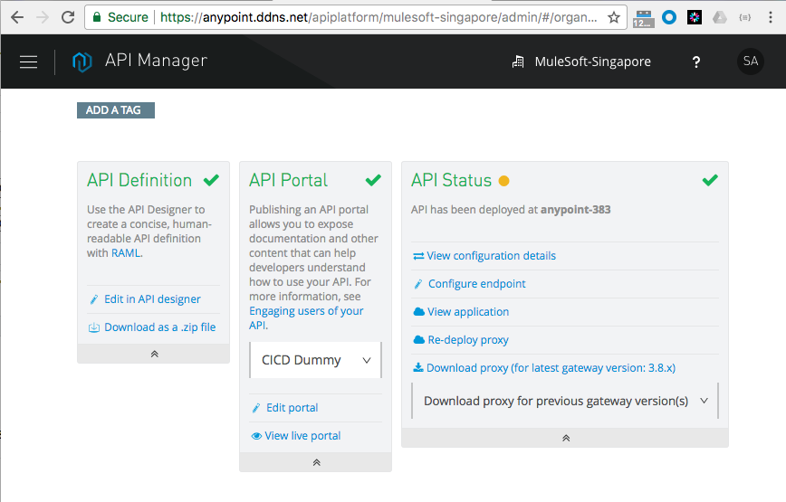
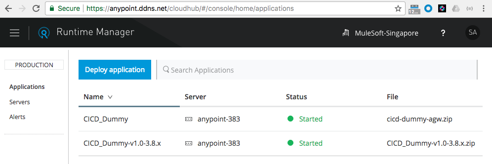
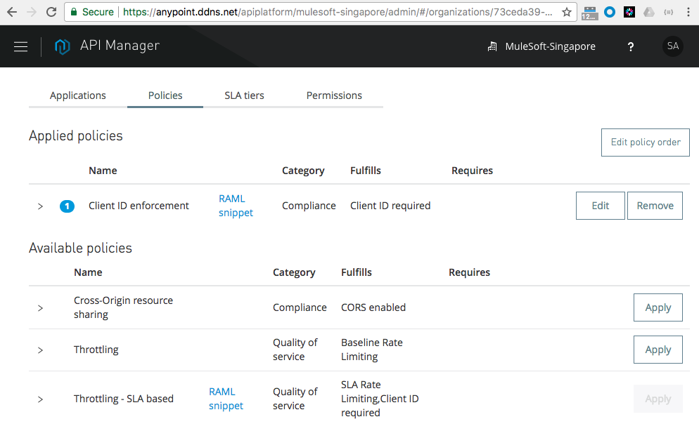

# How-to CICD for Private Cloud Edition

This is an example of command line tools to deploy, enable proxy, deploy proxy and apply policies to MuleSoft API deployed on Anypoint Private Cloud Edition.

## Getting Started

Please pull the sources from github

### Prerequisites

Installation of Anypoint CLI

https://docs.mulesoft.com/runtime-manager/anypoint-platform-cli

Installation of Newman

https://github.com/postmanlabs/newman

Gateway Domain in place, for instance:
- MULE_HOME/domains/api-gateway/mule-domain-config.xml
```
<mule-domain xmlns="http://www.mulesoft.org/schema/mule/ee/domain" xmlns:xsi="http://www.w3.org/2001/XMLSchema-instance" xmlns:http="http://www.mulesoft.org/schema/mule/http" xmlns:tls="http://www.mulesoft.org/schema/mule/tls" xsi:schemaLocation="http://www.mulesoft.org/schema/mule/ee/domain http://www.mulesoft.org/schema/mule/ee/domain/current/mule-domain-ee.xsd http://www.mulesoft.org/schema/mule/http http://www.mulesoft.org/schema/mule/http/current/mule-http.xsd http://www.mulesoft.org/schema/mule/tls http://www.mulesoft.org/schema/mule/tls/current/mule-tls.xsd">
    <http:listener-config name="http-lc-0.0.0.0-8081" host="0.0.0.0" port="8081" protocol="HTTP"/>
</mule-domain>
```

### Preparing the environment

Set up the environment variables:
```
export ANYPOINT_USERNAME=anthonyrabiaza
export ANYPOINT_PASSWORD=<your password>
export ANYPOINT_ENV=Sandbox
export ANYPOINT_PROFILE=apce-sin
```

Edit ~/.anypoint/credentials

```
{
"apce-sin": {
  "username": "anthonyrabiaza",
  "password": "<your password>",
  "organization": "MuleSoft-Singapore",
  "environment": "Production",
  "host": "anypoint.ddns.net"
 }
}
```

#### Deploying a project

Check the content of deploy_app.txt, it is deploying CICD Dummy Project (configured to work with a Domain)

Run the scripts:
```
./anypoint-cli-execute.sh cicd-deploy/deploy_app.txt
```

Result:






#### Linking of API and Application

This step is not automated and be skipped if the Policy Client ID is not used.
To manual to this step:
- From API Manager, "Create new Portal"
- View Live Portal
- Request API Access and note down the Client ID and Secret so they can be used in Postman to test the API


#### Enabling the Proxy

Check the content of enable_proxy.txt, it is enabling the Proxy of CICD Dummy API

Run the scripts:
```
./anypoint-cli-execute.sh cicd-deploy/enable_proxy.txt
```

Result: you will see a change in API Status block


#### Deploying the Proxy

Check the content of deploy_proxy.postman_collection/anypoint_pce.postman_environment, the API call are enabling the Proxy of CICD Dummy API. You can edit them with Postman

The two JSON file can be edit in Postman:

1. the first JSON file is Postman collection which consists of 3 API call to:
  * Authenticate to Anypoint API
  * List APIs to get CICD versions
  * Deploy the Proxy on CICD
  
2. the second JSON file is Environment file with configuration related to:
  * Authenticate to Anypoint API
  * List APIs to get CICD versions
  * Deploy the Proxy on CICD

Run the scripts:
```
./anypoint-api-execute.sh cicd-deploy/deploy_proxy.postman_collection cicd-deploy/anypoint_pce.postman_environment
```

Result: you will see a change in API Status block



#### Applying Policy

Check the content of deploy_clientid_enforcement.txt, it is applying client_id enforcement on CICD Dummy

Run the scripts:
```
./anypoint-cli-execute.sh cicd-deploy/deploy_clientid_enforcement.txt
```

Result: 


#### Testing
After few second the policy will be apply to the API (Proxy and Application), You can call the API via the Proxy (or directly) and check that it requires a client_id (if you did not link the API and the App):
```
{
  "error": "missing_client",
  "description": "client_id is missing"
}
```